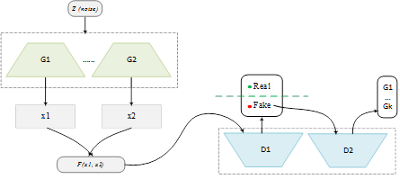
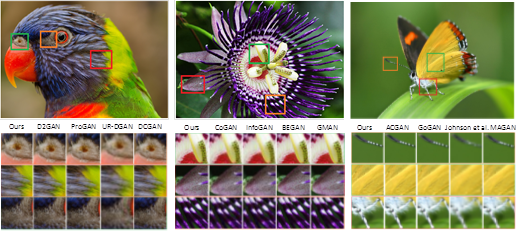
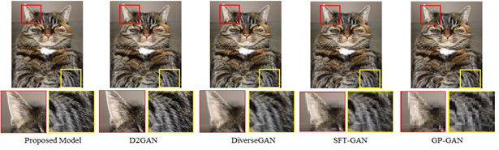
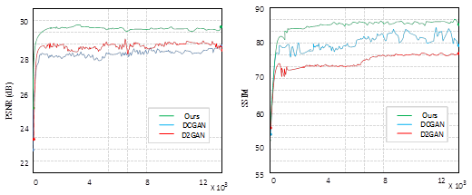
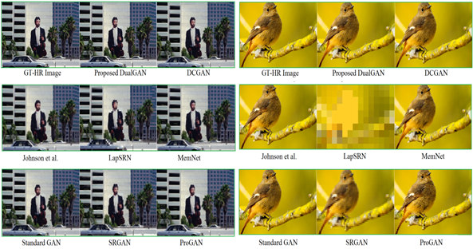
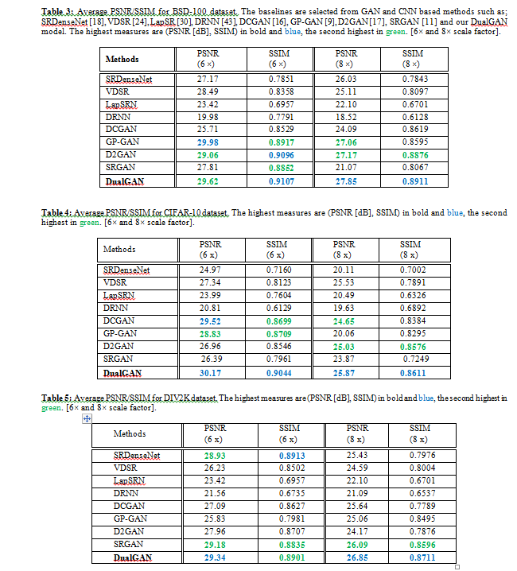

## Super Resolution with Dual generative adversarial network  


### DGAN Architecture

TensorFlow and Keras Implementation of ["Perceptual image quality using Dual generative adversarial network  "](https://link.springer.com/content/pdf/10.1007%2Fs00521-019-04239-0.pdf)

<a href="http://tensorlayer.readthedocs.io">
<div align="center">
	
</div>
</a>
</br>

### Results

<a href="http://tensorlayer.readthedocs.io">
<div align="center">
	
</div>
</a>
</br>
<a href="http://tensorlayer.readthedocs.io">
<div align="center">
	
</div>
</a>
</br>
<a href="http://tensorlayer.readthedocs.io">
<div align="center">
	
</div>
</a>
</br>

<a href="http://tensorlayer.readthedocs.io">
<div align="center">
	
</div>
</a>
</br>

<a href="http://tensorlayer.readthedocs.io">
<div align="center">
	
</div>
</a>
</br>

### Prepare Data and Pre-trained VGG

- 1. You need to download the pretrained VGG19 model in [here](https://mega.nz/#!xZ8glS6J!MAnE91ND_WyfZ_8mvkuSa2YcA7q-1ehfSm-Q1fxOvvs) as [tutorial_vgg19.py](https://github.com/zsdonghao/tensorlayer/blob/master/example/tutorial_vgg19.py) show.
- 2. You need to have the high resolution images for training.
  -  In this experiment, I used images from [DIV2K and CIFAR-10], so the hyper-paremeters in `config.py` (like number of epochs) are seleted basic on that dataset, if you change a larger dataset you can reduce the number of epochs. 
  -  If you dont want to use these dataset, you can also use [Yahoo MirFlickr25k](http://press.liacs.nl/mirflickr/mirdownload.html), just simply download it using `train_hr_imgs = tl.files.load_flickr25k_dataset(tag=None)` in `main.py`. 
  
### Run

```python
config.TRAIN.img_path = "your_image_folder/"
```

- Start training.

```bash
python main.py
```

```bash
python main.py --mode=evaluate 
```


### Citation
If you find this project useful, we would be grateful if you cite the paper：

```
@article{tensorlayer2017,
author = {Zareapoor, Masoumeh and Huiyu Zhou and Yang, Jie},
journal = {Neural Computing and Applications},
title = {{Perceptual image quality using dual generative adversarial network}},
year = {2019}
}
```


